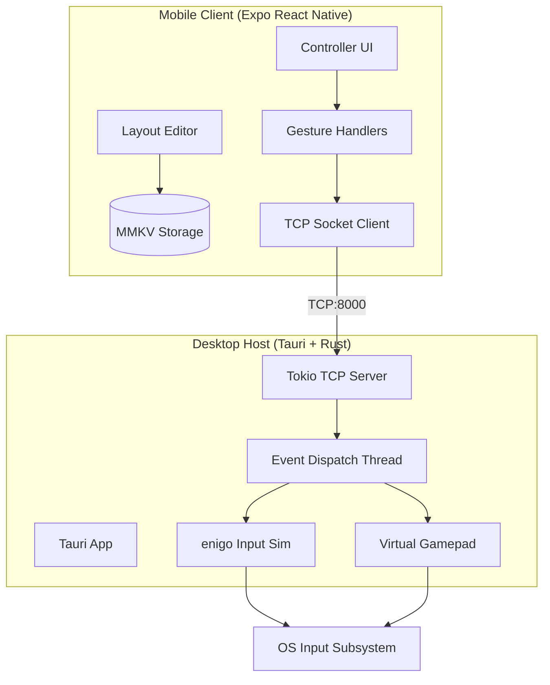
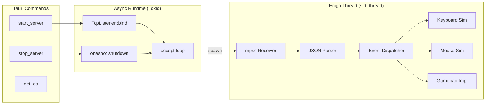
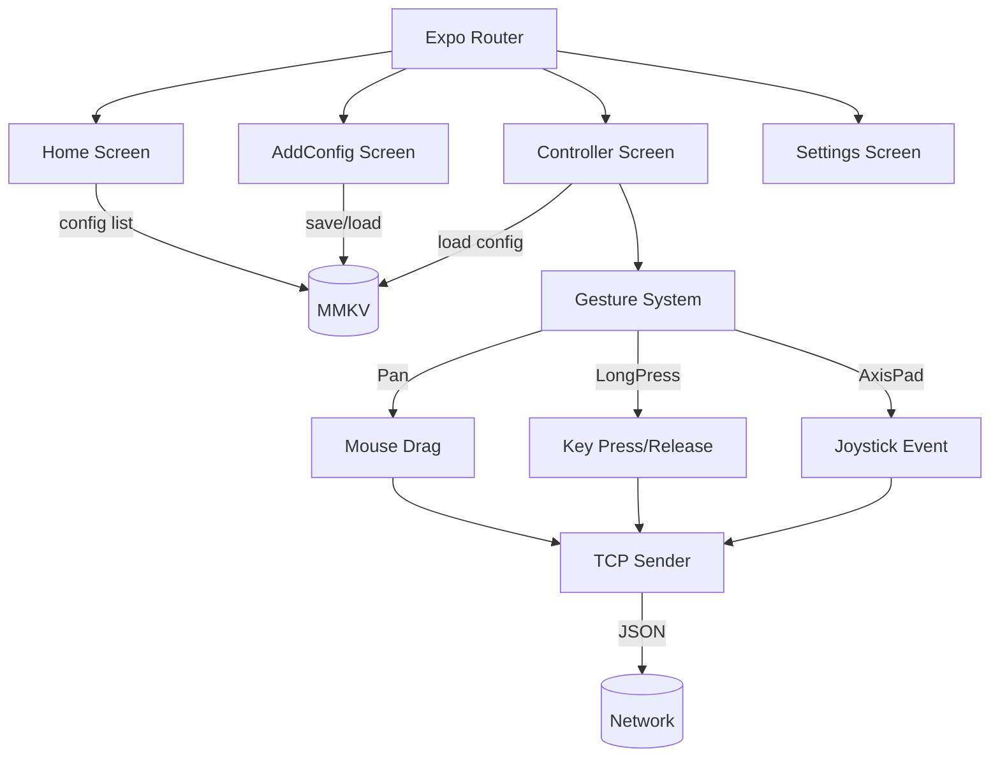
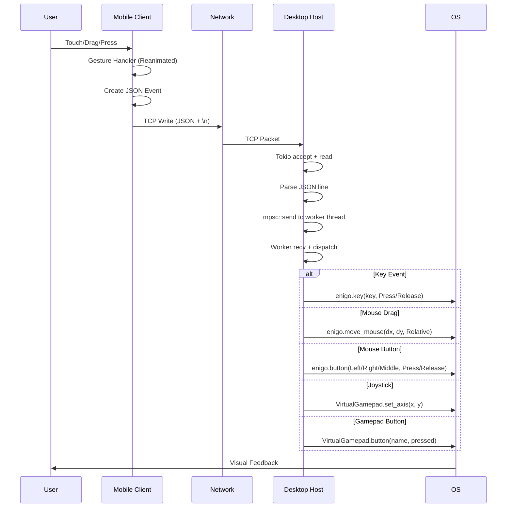

# VirGO Architecture Documentation

## System Overview

VirGO is a distributed input simulation system with two main components communicating over TCP.



## Component Details

### Desktop Host (Rust Backend)



### Mobile Client (React Native)



## Event Processing Pipeline



## Cross-Platform Gamepad Abstraction

```mermaid
graph TB
    Interface[VirtualGamepad Trait]
    Interface -->|impl| Windows[Windows: ViGEm]
    Interface -->|impl| Linux[Linux: uinput]

    subgraph Windows["Windows Implementation"]
        VigEmClient[vigem_client::Client]
        XboxTarget[Xbox360Wired Target]
        XUsbReport[XUsb Report Struct]
        Windows --> VigEmClient
        VigEmClient --> XboxTarget
        XboxTarget --> XUsbReport
    end

    subgraph Linux["Linux Implementation"]
        UInput[uinput VirtualDevice]
        AbsSetup[ABS_X, ABS_Y, ABS_RX, ABS_RY]
        KeyCodes[BTN_SOUTH, BTN_EAST, ...]
        Linux --> UInput
        UInput --> AbsSetup
        UInput --> KeyCodes
    end

    Interface -.->|set_axis(x,y)| Windows
    Interface -.->|set_axis(x,y)| Linux
    Interface -.->|button(name,pressed)| Windows
    Interface -.->|button(name,pressed)| Linux
```

## Data Models

### Controller Configuration (JSON)
```json
{
  "id": "nanoid-string",
  "name": "My FPS Layout",
  "buttons": [
    {
      "id": "btn-1",
      "input": "w",
      "name": "Forward",
      "type": "key",
      "x": -120,
      "y": -200,
      "option": {
        "width": 80,
        "height": 80,
        "borderWidth": 2,
        "borderRadius": 12,
        "borderColor": "#06b6d4",
        "opacity": 0.9
      }
    },
    {
      "id": "joy-1",
      "input": "joystick",
      "name": "Movement",
      "type": "joystick",
      "x": 0,
      "y": 150,
      "option": {
        "width": 120,
        "height": 120,
        "borderWidth": 2,
        "borderRadius": 60,
        "borderColor": "#06b6d4",
        "opacity": 1
      }
    }
  ]
}
```

### TCP Event Format (newline-delimited)
```json
{"key":"w","action":"press","type":"key"}
{"key":"0.1,0.0","action":"drag","type":"mouse"}
{"key":"0.3,0.7","action":"joystick","type":"joystick"}
{"key":"a","action":"press","type":"gamepad_button"}
```

## Threading Model

```mermaid
graph TB
    subgraph Main["Main Thread (Tauri)"]
        UI[WebView UI]
        Commands[Tauri Command Handlers]
    end

    subgraph Tokio["Tokio Runtime"]
        Listener[TcpListener]
        Acceptor[Connection Acceptor Tasks]
        Shutdown[Shutdown Signal]
    end

    subgraph Worker["Enigo Worker Thread (blocking)"]
        Loop[while rx.recv()]
        EnigoInst[Enigo Instance]
        GamepadInst[VirtualGamepad Instance]
    end

    Commands -->|start_server| Listener
    Listener --> Acceptor
    Acceptor -->|per connection| Loop
    Loop --> EnigoInst
    Loop --> GamepadInst
    Commands -->|stop_server| Shutdown
    Shutdown -.-> Acceptor
    Shutdown -.-> Loop
```

## Network Configuration

```
Phone (USB)          Desktop Host
┌─────────┐    adb reverse    ┌─────────────┐
│ Expo App│ ───────────────►  │ TCP:8000    │
│ Port 8000│ ◄───────────────  │ 127.0.0.1   │
└─────────┘   tcp:8000        └─────────────┘
                    │
                    ▼
            ┌─────────────┐
            │ Enigo Thread│
            │ Gamepad     │
            └─────────────┘
```

- **adb reverse** forwards phone's localhost:8000 to desktop's localhost:8000
- Works over USB without WiFi network configuration
- Fallback: direct WiFi IP if adb not available

## Security Considerations

| Aspect | Implementation |
|--------|----------------|
| Auth | None (local network/USB only) |
| Encryption | None (local trusted network) |
| Input Validation | JSON parsing with serde, bounds checking on coords |
| Privilege | Requires accessibility/input permissions on desktop |
| Scope | User-level input simulation only |

---

## Future Improvements

- [ ] TLS/mTLS for WiFi deployments
- [ ] Bluetooth LE transport option
- [ ] Multi-device support (tablet + phone)
- [ ] Haptic feedback on mobile
- [ ] Macro/sequence recording
- [ ] Cloud sync for profiles
- [ ] WebRTC for lower latency over WiFi